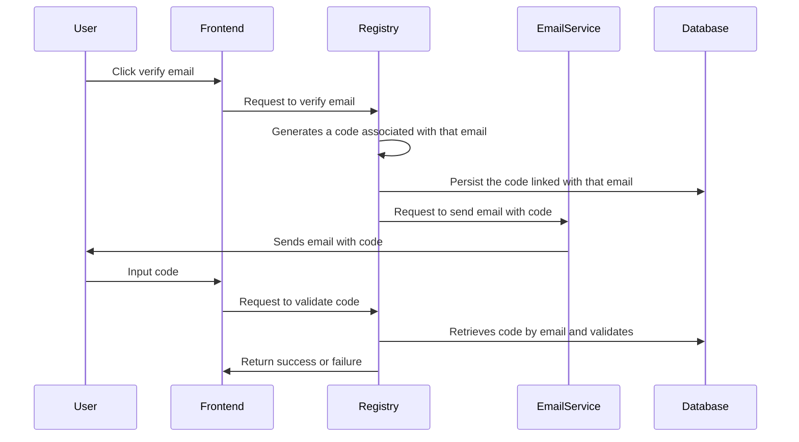

# AWS SES Email Service PoC


## AWS SES
We need access and secret keys with the following actions for the application in order to use SES:

```json
{
    "Version": "2012-10-17",
    "Statement": [
        {
            "Effect": "Allow",
            "Action": [
                "ses:SendEmail",
                "ses:SendRawEmail"
            ],
            "Resource": "*"
        }
    ]
}
```
 Also, a verified email address or domain is necessary. It can easily be done by following instructions in the AWS Console. Ir order to verify the domain, it is required some extra steps since it is based on DomainKeys Identified Mail (DKIM). It will also be necessary to ask AWS for production access in the SES service. AWS does this in order to prevent new accounts to spam people.

## Email verification

In order to verify the user's email, we can generate a code that is sent by emial to the user. Here's a diagram that shows the sequence of actions:



## Freemaker Template

In order to generate the email, I've used Freemaker library for HTML parsing. Variables can be replaced by using this syntax:
```html
<p>Hello ${name}! This is the requested code: ${code}</p>
```
And in java:
```java
Map<String, Object> model = new HashMap<>();
      model.put("name", "Gustavo Teixeira");
      model.put("code", "548621");
      String html = FreeMarkerTemplateUtils.processTemplateIntoString(t, model);
```
